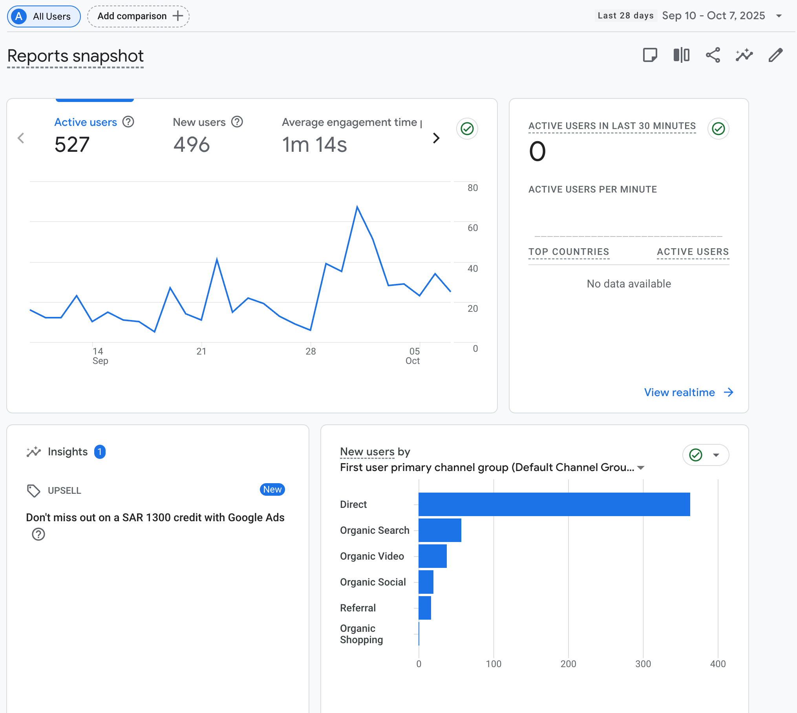
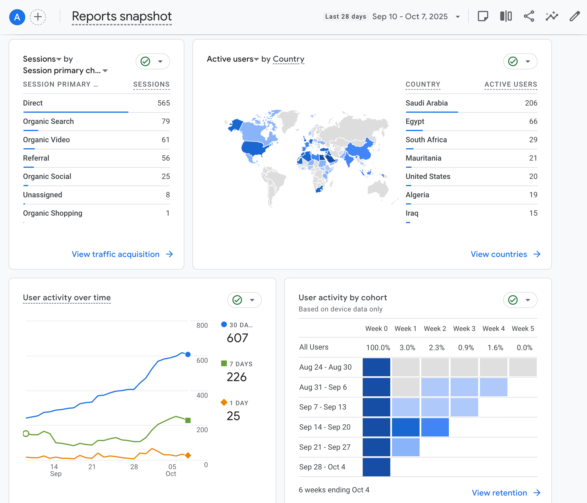
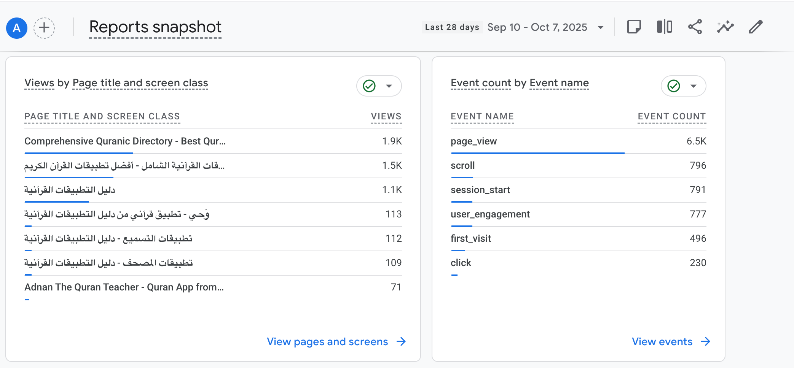

# Qur'an Apps Directory - 1-Page User ROI Plan

## What it is
A community-run directory that helps people find trustworthy curated advert free Qur'an apps fast. Clear reviews, need-based filters, and side-by-side comparisons so users decide in under 2 minutes.

## Who we serve → user ROI
- General public: Teachers, learners, parents, youth, teachers - quick, confident app choice for a specific need.
- Developers - qualified users and actionable reviews.
- Partners - transparent monthly scorecard.

## Why we are different
| Area | Others | Us |
| - | - | - |
| Assessment | Star opinions | Rubric: Accuracy, Usability, Privacy, Accessibility, Teaching value |
| Trust | Opaque | Trust panel: criteria, last update, privacy badge, evidence notes |
| Findability | Broad categories | Filters: age, offline, ads-free, tajweed level, teacher tools, language |
| Decision speed | Many clicks | 2-3 app compare + short "Why this app" |
| Community | Passive | Discord help, review drives, weekly top picks |
| Accountability | No goals | Public scorecard with targets |

## Engagement Stats

### 📊 User Acquisition & Traffic
- **Active Users (30d):** 607 • **New Users (30d):** 496
- **Sessions (30d):** 795 • **Avg Engagement Time:** 1m 14s
- **Peak Active Users/min:** 80 • **Real-time Active:** 3
- **Traffic Sources:** Direct (565, 71%), Organic Search (79), Organic Video (61)

### 🌍 Geographic Distribution
- **Top Countries:** Saudi Arabia (206), Egypt (66), South Africa (29)
- **Regional Insight:** Strong MENA presence with Saudi Arabia leading

### 🎯 Engagement & Behavior
- **Page Views:** 6.5K • **User Actions:** Scroll (796), Click (230)
- **Engagement Indicators:** Active scrolling and clicking behavior

### 📱 Content Performance
- **Top Page:** "Comprehensive Quranic Directory" (1.9K views)
- **Arabic Content:** Strong performance (1.5K, 1.1K views on key pages)
- **Content Strategy:** Directory content driving significant traffic

### 📈 Retention Metrics
- **Week 1 Retention:** 3.0% (major improvement opportunity)
- **Reviews/Month:** [count] (tracking needed)

**Baseline Assessment:** Strong user acquisition with engagement challenges. Direct traffic dominates (71%) with solid MENA regional presence. Low retention (3%) indicates primary growth opportunity.

## 90-day improvements
- Faster findability - ship opinionated filters → Search→App CTR +30%
- More trust - add Trust panel → Store CTR +25%
- Decide faster - side-by-side compare → Time-to-first-good-match < 2 minutes
- Ongoing value - weekly Top Picks + Discord #ask-for-app → D7 return +20%
- Better reviews - rubric + moderation + badges → 15+ accepted reviews/week

## Public scorecard targets
- Time-to-first-good-match: < 2 minutes
- Search→App CTR: +30% from baseline
- Store CTR: +25% from baseline
- Saves per active user: 1.5+
- Accepted reviews/week: 15+
- D7 and D30 return: +20% from baseline
- Teacher-tested labels: 10 in 90 days

## 12-month vision
The default place families and educators recommend for Qur'an apps, with transparent reviews of every major app and a public scorecard updated monthly.

---

*Owner: Abubakr Abduraghman, a.abduraghman@itqan.dev*
